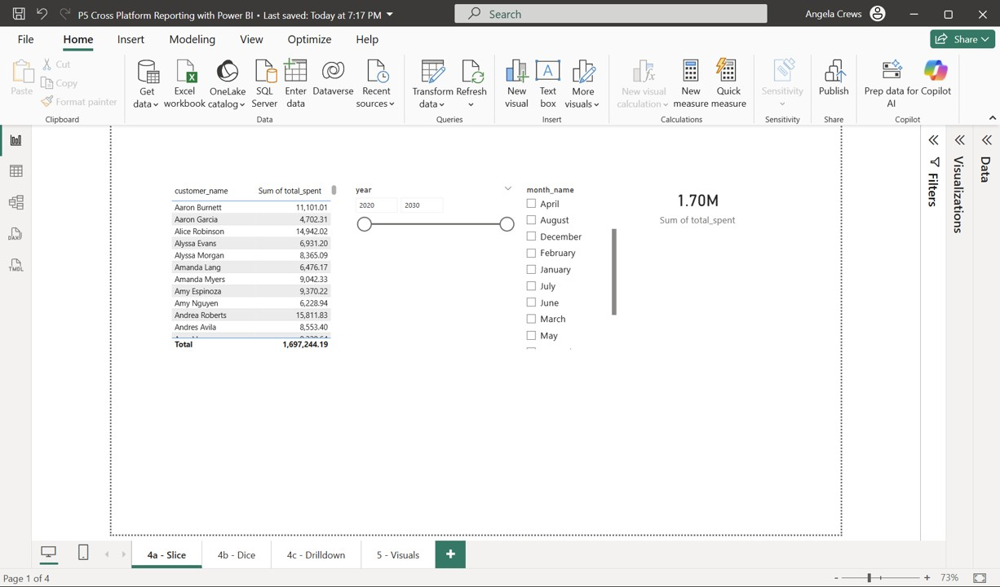
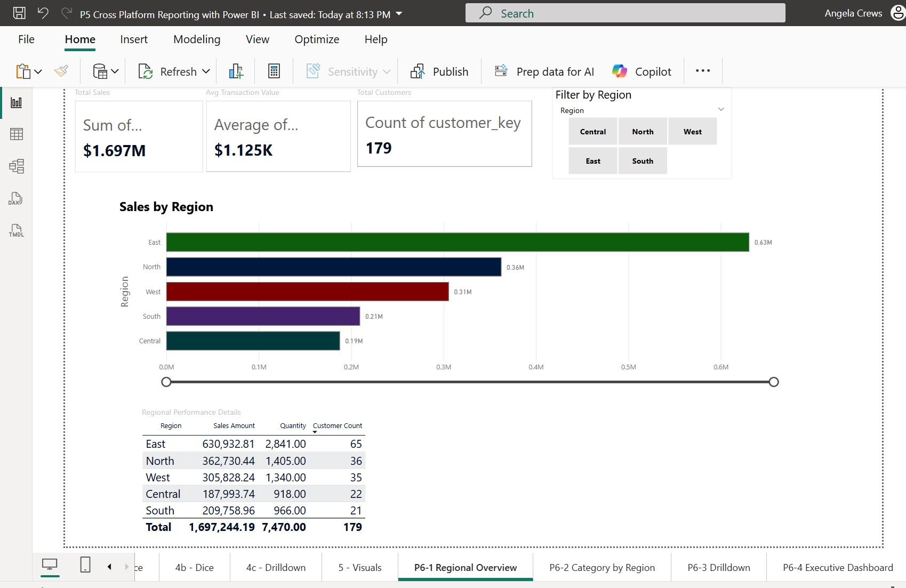
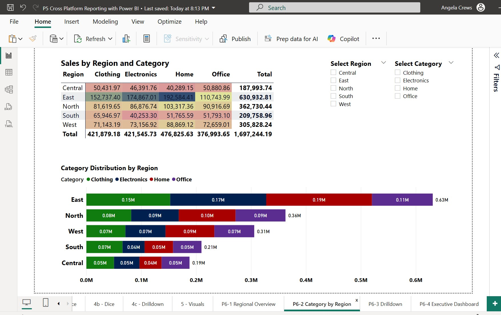
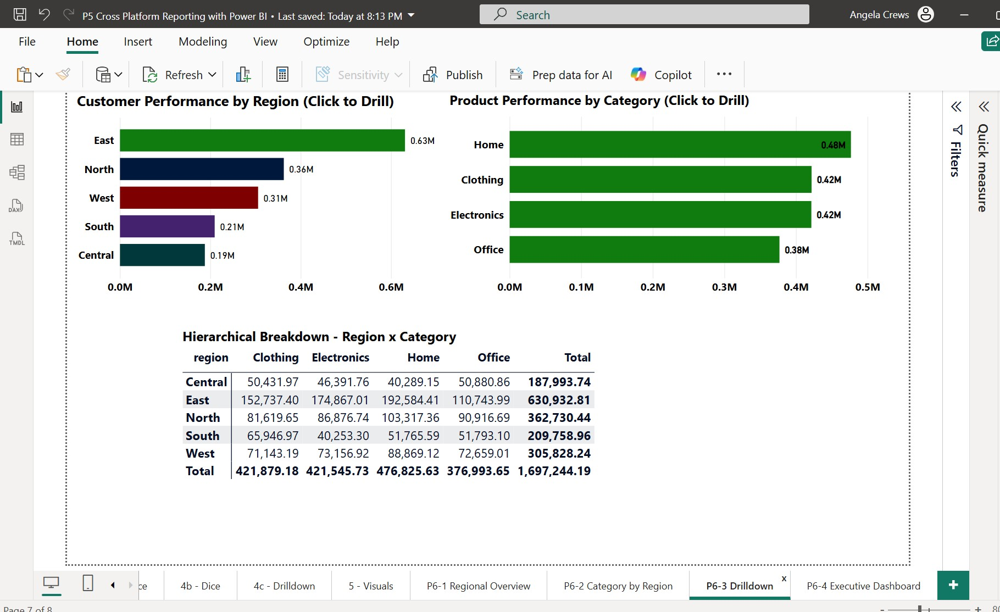
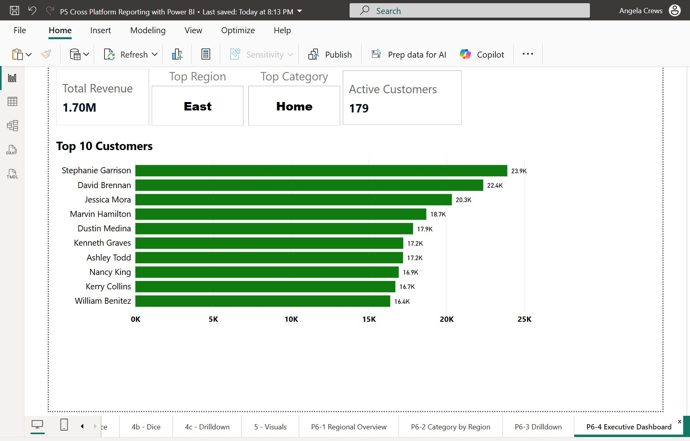

# Pro Analytics 02 Python Starter Repository

> Use this repo to start a professional Python project.

- Additional information: <https://github.com/denisecase/pro-analytics-02>
- Project organization: [STRUCTURE](./STRUCTURE.md)
- Build professional skills:
  - **Environment Management**: Every project in isolation
  - **Code Quality**: Automated checks for fewer bugs
  - **Documentation**: Use modern project documentation tools
  - **Testing**: Prove your code works
  - **Version Control**: Collaborate professionally

---

## WORKFLOW 1. Set Up Your Machine

Proper setup is critical.
Complete each step in the following guide and verify carefully.

- [SET UP MACHINE](./SET_UP_MACHINE.md)

---

## WORKFLOW 2. Set Up Your Project

After verifying your machine is set up, set up a new Python project by copying this template.
Complete each step in the following guide.

- [SET UP PROJECT](./SET_UP_PROJECT.md)

It includes the critical commands to set up your local environment (and activate it):

```shell
uv venv
uv python pin 3.12
uv sync --extra dev --extra docs --upgrade
uv run pre-commit install
uv run python --version
```

**Windows (PowerShell):**

```shell
.\.venv\Scripts\activate
```
---

## WORKFLOW 3. Daily Workflow

Please ensure that the prior steps have been verified before continuing.
When working on a project, we open just that project in VS Code.

### 3.1 Git Pull from GitHub

Always start with `git pull` to check for any changes made to the GitHub repo.

```shell
git pull
```

### 3.2 Run Checks as You Work

This mirrors real work where we typically:

1. Update dependencies (for security and compatibility).
2. Clean unused cached packages to free space.
3. Use `git add .` to stage all changes.
4. Run ruff and fix minor issues.
5. Update pre-commit periodically.
6. Run pre-commit quality checks on all code files (**twice if needed**, the first pass may fix things).
7. Run tests.

In VS Code, open your repository, then open a terminal (Terminal / New Terminal) and run the following commands one at a time to check the code.

```shell
uv sync --extra dev --extra docs --upgrade
uv cache clean
git add .
uvx ruff check --fix
uvx pre-commit autoupdate
uv run pre-commit run --all-files
git add .
uv run pytest
```

NOTE: The second `git add .` ensures any automatic fixes made by Ruff or pre-commit are included before testing or committing.

<details>
<summary>Click to see a note on best practices</summary>

`uvx` runs the latest version of a tool in an isolated cache, outside the virtual environment.
This keeps the project light and simple, but behavior can change when the tool updates.
For fully reproducible results, or when you need to use the local `.venv`, use `uv run` instead.

</details>

### 3.3 Build Project Documentation

Make sure you have current doc dependencies, then build your docs, fix any errors, and serve them locally to test.

```shell
uv run mkdocs build --strict
uv run mkdocs serve
```

- After running the serve command, the local URL of the docs will be provided. To open the site, press **CTRL and click** the provided link (at the same time) to view the documentation. On a Mac, use **CMD and click**.
- Press **CTRL c** (at the same time) to stop the hosting process.

### 3.4 Execute

This project includes demo code.
Run the demo Python modules to confirm everything is working.

In VS Code terminal, run:

```shell
uv run python -m analytics_project.demo_module_basics
uv run python -m analytics_project.demo_module_languages
uv run python -m analytics_project.demo_module_stats
uv run python -m analytics_project.demo_module_viz
```

You should see:

- Log messages in the terminal
- Greetings in several languages
- Simple statistics
- A chart window open (close the chart window to continue).

If this works, your project is ready! If not, check:

- Are you in the right folder? (All terminal commands are to be run from the root project folder.)
- Did you run the full `uv sync --extra dev --extra docs --upgrade` command?
- Are there any error messages? (ask for help with the exact error)

---

### 3.5 Git add-commit-push to GitHub

Anytime we make working changes to code is a good time to git add-commit-push to GitHub.

1. Stage your changes with git add.
2. Commit your changes with a useful message in quotes.
3. Push your work to GitHub.

```shell
git add .
git commit -m "describe your change in quotes"
git push -u origin main
```

This will trigger the GitHub Actions workflow and publish your documentation via GitHub Pages.

### 3.6 Modify and Debug

With a working version safe in GitHub, start making changes to the code.

Before starting a new session, remember to do a `git pull` and keep your tools updated.

Each time forward progress is made, remember to git add-commit-push.


### 3.7 Reading Raw Data into Pandas DataFrames

1. Read through the assignment
2. Opened project in VS Code
3. Added new source file:
   - Created `src/analytics_project/data_prep.py`
   - Retrieved from <https://github.com/denisecase/smart-sales-starter-files>
4. Executed the module
5. Git Add-Commit-Push to GitHub
6. Updated README.md file to record steps of process

### 3.8 Data Collection

Added a numeric and category column to existing raw CSV files and filled with fake data:

- `customers_data.csv`
- `products_data.csv`
- `sales_data.csv`

### 3.9 Data Cleaning & ETL Preparation

Created a new folder `src/analytics_project/data_preparation/` with individual files for each CSV:

- `prepare_customers.py`
- `prepare_products.py`
- `prepare_sales.py`

**Summary of the Process:** See the comprehensive documentation at
<https://github.com/Angie-Crews/smart-store-angie/blob/main/docs/data_preparation_pipeline.md>
### 3.10 Prepare Data for ETL

#### Created `data_scrubber.py` Utility

Created `src/analytics_project/data_scrubber.py` with reusable data cleaning methods.

**Completed TODO Task:**

- **Before:** `self.df[column] = self.df[column]`  # Does nothing!
- **After:** `self.df[column] = self.df[column].str.upper().str.strip()`  # ✅ Works!

**How It Works:**

- `.str.upper()` - Converts all text to UPPERCASE
  - Example: "hello world" → "HELLO WORLD"
- `.str.strip()` - Removes leading/trailing whitespace
  - Example: "  HELLO WORLD  " → "HELLO WORLD"
- **Chaining** - The methods are chained together, so both operations happen in sequence

#### Created Master Pipeline Orchestrator

Created `src/analytics_project/run_all_data_prep.py` to execute all three preparation scripts in one action:

```shell
python src\analytics_project\run_all_data_prep.py
```

This runs:

- `prepare_customers.py`
- `prepare_products.py`
- `prepare_sales.py`

---

## WORKFLOW 4. Data Warehouse Design & Implementation (Project 4)

After cleaning and preparing data in P3, the next step is designing and implementing a data warehouse for efficient data analysis and business intelligence.

### 4.1 Design Decisions

**Schema Type:** Star Schema
**Rationale:** Chosen for simpler queries, better performance, and easier understanding

**Tables:**
- **Fact Table:** `sales` (1,509 transactions)
- **Dimension Tables:** `customers` (179 records), `products` (100 records), `dates` (1 record)

**Naming Convention:** D4.2 Standard
- Lowercase table names (sales, customers, products, dates)
- Snake_case column names (customer_key, sales_amount, product_name)
- Reference: <https://github.com/denisecase/smart-sales-docs/blob/main/D42_Design_DW.md>

### 4.2 Implementation Files

Created three Python scripts in `src/analytics_project/`:

1. **`create_warehouse.py`** - Defines schema and creates database structure
2. **`load_warehouse.py`** - ETL process to populate warehouse from prepared CSV files
3. **`query_warehouse.py`** - 8 analytical queries demonstrating warehouse capabilities

### 4.3 Schema Details

**Fact Table: sales**
```sql
sale_id (INTEGER PK), transaction_id (TEXT),
customer_key (INTEGER FK), product_key (INTEGER FK), date_key (INTEGER FK),
quantity (INTEGER), sales_amount (REAL),
campaign_id (INTEGER), payment_method (TEXT)
```

**Dimension: customers**
```sql
customer_key (INTEGER PK), customer_id (TEXT),
name (TEXT), email (TEXT), region (TEXT),
join_date (TEXT), customer_age (INTEGER)
```

**Dimension: products**
```sql
product_key (INTEGER PK), product_id (TEXT),
product_name (TEXT), category (TEXT), unit_price (REAL),
stock_level (INTEGER), product_size (TEXT)
```

**Dimension: dates**
```sql
date_key (INTEGER PK), full_date (TEXT),
year (INTEGER), quarter (INTEGER), month (INTEGER), month_name (TEXT),
day (INTEGER), day_of_week (INTEGER), day_name (TEXT), is_weekend (INTEGER)
```

### 4.4 Running the Data Warehouse

Execute the complete workflow:

```powershell
# 1. Create schema
python src\analytics_project\create_warehouse.py

# 2. Load data via ETL
python src\analytics_project\load_warehouse.py

# 3. Run analytical queries
python src\analytics_project\query_warehouse.py
```

**Expected Results:**
- Schema: 4 tables created with 14 performance indexes
- Data Load: 179 customers, 100 products, 1 date, 1,509 sales
- Queries: 8 analytical reports (top customers, category performance, regional analysis, etc.)

### 4.5 Key Insights from Queries

- **Top Customer:** Stephanie Garrison ($23,909 total spent)
- **Best Category:** Home ($476,826 revenue)
- **Top Region:** East ($630,933 revenue, 65 customers)
- **Most Effective Campaign:** Campaign 3 ($490,726 revenue, $1,348 avg sale)
- **High-Value Customers:** 41 customers with 10+ purchases averaging $14,104 lifetime value

### 4.6 Challenges Encountered

1. **Naming Convention Refactoring** - Initially implemented PascalCase (DimCustomer, FactSales) but refactored to D4.2 lowercase standard. Required updating all three scripts and careful testing.

2. **Data Quality Issues** - 178 sales records (out of 1,687) referenced non-existent customers. Implemented foreign key validation to maintain referential integrity.

3. **Inconsistent Source Data** - CSV files had mixed column naming (CustomerID vs customerid), requiring type conversion in ETL.

4. **Single Date Limitation** - All transactions occurred on 2025-05-04, limiting time-based analysis but demonstrating structure for future expansion.

5. **Missing Payment Method Data** - Source data lacked actual payment types (all show "Unknown"), identified as future enhancement.

### 4.7 Documentation

Comprehensive warehouse documentation available at:
**[docs/data_warehouse.md](./docs/data_warehouse.md)**

Includes:
- Complete schema reference with all columns and data types
- ETL workflow and data flow diagrams
- All 8 analytical queries with SQL, sample results, and business insights
- Troubleshooting guide and future enhancements

### 4.8 Database Location

```
c:\Repos\smart-store-angie\data\warehouse\smart_store_dw.db
```

View in VS Code using SQLite Viewer extension.

---

## WORKFLOW 4B. (Optional) Finalizing Data Warehouse - Professional Naming

After completing the initial data warehouse, we implemented professional BI naming conventions to align with industry standards.

### 4B.1 Table Renaming (dim_* and fact_* Prefixes)

**Rationale:** Many BI environments use standardized prefixes to distinguish dimension tables (`dim_*`) from fact tables (`fact_*`). This makes the data model more immediately recognizable to other data professionals.

**Tables Renamed:**
- `customers` → `dim_customers`
- `products` → `dim_products`
- `dates` → `dim_dates`
- `sales` → `fact_sales`

**Implementation:**
1. Updated `create_warehouse.py` to use new table names
2. Updated `load_warehouse.py` to load data into new tables
3. Updated `query_warehouse.py` with new table references in all analytical queries
4. Rebuilt the data warehouse with professional naming convention
5. Updated Power BI data source connections to use new table names

**Verification:**
```bash
python src\analytics_project\create_warehouse.py
python src\analytics_project\load_warehouse.py
python src\analytics_project\query_warehouse.py
```

All queries executed successfully with the new naming convention. Power BI report updated in Power Query Editor to reference `dim_customers`, `dim_products`, `dim_dates`, and `fact_sales`.

### 4B.2 Expanded Date Dimension (2020-2030)

**Rationale:** A comprehensive date dimension supports rich time-based analysis including:
- Year-over-year comparisons
- Seasonal trend analysis
- Historical context and future planning
- Proper line charts and time series visualizations

**Implementation:**
Updated `load_warehouse.py` to generate dates from 2020-01-01 to 2030-12-31 instead of deriving dates only from sales transactions.

**Results:**
- **Previous:** 1 date record (2025-05-04 only)
- **Current:** 4,018 date records (11-year span)
- Each date includes: year, quarter, month, month_name, day, day_of_week, day_name, is_weekend

**Date Dimension Schema:**
```sql
CREATE TABLE dim_dates (
    date_key INTEGER PRIMARY KEY,        -- YYYYMMDD format (e.g., 20250504)
    full_date TEXT UNIQUE NOT NULL,      -- YYYY-MM-DD format
    year INTEGER NOT NULL,
    quarter INTEGER NOT NULL,
    month INTEGER NOT NULL,
    month_name TEXT NOT NULL,
    day INTEGER NOT NULL,
    day_of_week INTEGER NOT NULL,        -- 0=Monday, 6=Sunday
    day_name TEXT NOT NULL,
    is_weekend INTEGER NOT NULL          -- 1=Weekend, 0=Weekday
)
```


*Figure: Power BI date slicers showing expanded range (2020-2030) supporting comprehensive time-based analysis*

Power BI date slicers and hierarchies now support full time range analysis.

---

## WORKFLOW 5. Cross-Platform Reporting with Power BI (Project 5)

After designing and implementing the data warehouse in P4, we now analyze and visualize the stored data to generate business intelligence insights using Power BI Desktop.

### 5.1 Tools and Setup

**Operating System:** Windows 11
**Tool:** Power BI Desktop (November 2025, v2.149.911.0 64-bit)
**Connection Method:** SQLite ODBC Driver
**Database:** `c:\Repos\smart-store-angie\data\warehouse\smart_store_dw.db`

**Setup Steps:**
1. Installed SQLite ODBC Driver for Windows (64-bit)
2. Connected Power BI to SQLite database via ODBC
3. Loaded all 4 tables: dim_customers, dim_products, dim_dates, fact_sales
4. Power BI auto-detected relationships based on foreign keys

### 5.2 Data Model

**Power BI Model View** shows star schema with relationships:


*Figure 1: Sales to Customers relationship (customer_key)*


*Figure 2: Sales to Products relationship (product_key)*


*Figure 3: Sales to Dates relationship (date_key)*

**Relationships:**
- `fact_sales.customer_key` → `dim_customers.customer_key` (many-to-one)
- `fact_sales.product_key` → `dim_products.product_key` (many-to-one)
- `fact_sales.date_key` → `dim_dates.date_key` (many-to-one)

### 5.3 SQL Query for Analysis

Created **Sales_Analysis** query in Power Query Editor:

```sql
SELECT
    c.name AS customer_name,
    SUM(s.sales_amount) AS total_spent
FROM fact_sales s
JOIN dim_customers c ON s.customer_key = c.customer_key
GROUP BY c.name
ORDER BY total_spent DESC
```

This query aggregates total spending by customer (179 customers, sorted by revenue).

### 5.4 OLAP Operations

#### Operation 1: SLICE - Filter by One Dimension

**What is Slice?** Filtering data by a single dimension (e.g., date).


*Figure 4: SLICE operation using date slicers (year and month)*

**Implementation:**
- Added Year slicer (shows: 2025)
- Added Month slicer (shows: May)
- Table displays customer names and total spent
- Card shows total sales amount
- When slicer values change, all visuals filter accordingly

#### Operation 2: DICE - Filter by Multiple Dimensions

**What is Dice?** Filtering data by TWO OR MORE dimensions simultaneously (e.g., category AND price).


*Figure 5: DICE operation using category and price range filters*

**Implementation:**
- Category slicer (Clothing, Electronics, Home, Office)
- Unit Price slider (range filter)
- Table shows products filtered by both dimensions
- Example: Electronics products priced between $500-$800
- Card shows total sales for filtered subset

#### Operation 3: DRILLDOWN - Navigate Hierarchies

**What is Drilldown?** Starting with aggregated data and drilling into progressively more detailed levels.


*Figure 6: DRILLDOWN operation with date and customer hierarchies*

**Implementation:**

**Date Hierarchy:**
- Created hierarchy: Year → Quarter → Month
- Matrix visual shows expandable structure
- Drill: 2025 → Q2 → May
- Custom column created for quarter display ("Q2" instead of "2.00")

**Customer Hierarchy:**
- Created hierarchy: Region → Customer Name
- Clustered bar chart with 5 regions (Central, East, North, South, West)
- Click region bar to drill down to individual customers
- Multi-colored bars for visual distinction

### 5.5 Additional Visualizations

Created comprehensive dashboard with multiple chart types:


*Figure 7: Task 5 - Additional visualizations including Top 10 customers and regional analysis*

**Visuals Created:**
1. **Clustered Bar Chart** - Top 10 Customers by Total Spent
   - Shows highest-value customers
   - Multi-colored bars for each customer
   - Filtered to top 10 using Top N filter

2. **Stacked Column Chart** - Sales by Region and Category
   - X-axis: Region (Central, East, North, South, West)
   - Y-axis: Sales Amount
   - Legend: Product Category (colored stacks)
   - Shows which categories perform best in each region

3. **Category Slicer** - Interactive Filter
   - Allows filtering all visuals by product category
   - Enables interactive exploration of data### 5.6 Key Business Insights

From Power BI analysis:

- **Top Customer:** Stephanie Garrison with $23,909 in total purchases
- **Regional Performance:** East region leads with $630,933 (37% of total revenue)
- **Category Mix:** Home products dominate with $476,826, followed by Clothing and Electronics
- **Customer Distribution:** 179 customers across 5 regions, with East having 65 customers (36%)
- **High-Value Segment:** Top 10 customers account for significant revenue concentration

### 5.7 Challenges and Solutions

**Challenge 1: Single Date in Dataset**
- **Issue:** All sales occurred on 2025-05-04, making line charts show single point
- **Solution:** Changed to stacked column chart showing region/category breakdown instead of trends over time
- **Alternative:** Created date hierarchy to demonstrate drilldown capability even with limited date range

**Challenge 2: Numeric Display of Quarter**
- **Issue:** Quarter field showed as "2.00" instead of "Q2"
- **Solution:** Created custom column in Power Query Editor: `"Q" & Text.From([quarter])`
- **Result:** Hierarchy displays as Year → Q2 → May

**Challenge 3: Bar Chart Colors**
- **Issue:** All bars showed same color by default
- **Solution:** Added customer_name to Legend field well
- **Result:** Each bar automatically assigned different color from theme

**Challenge 4: SQLite ODBC Connection**
- **Issue:** Chrome blocked HTTP download of ODBC driver
- **Solution:** Used Microsoft Edge browser or bypassed security warning
- **Connection String:** `Driver={SQLite3 ODBC Driver};Database=c:\Repos\smart-store-angie\data\warehouse\smart_store_dw.db`

### 5.8 Power BI File Location

```
c:\Repos\smart-store-angie\smart_store_reports.pbix
```

**File Size:** Contains 4 tables (1,789 total records), 5 report pages, multiple visualizations
**Report Pages:**
1. SLICE - Date filtering demonstration
2. DICE - Multi-dimensional filtering
3. DRILLDOWN - Hierarchical navigation
4. Task 5 - Visuals - Comprehensive dashboard
5. (Additional pages as created)

### 5.9 Tools and Skills Demonstrated

**Power BI Skills:**
- ODBC data source connection
- Power Query Editor with SQL
- Data modeling and relationship management
- OLAP operations (Slice, Dice, Drilldown)
- Hierarchy creation and navigation
- Multiple visualization types (Table, Matrix, Bar, Column, Card, Slicer)
- Interactive filtering and cross-filtering
- Custom column creation with DAX/M expressions
- Theme application and color customization
- Top N filtering

**Business Intelligence Concepts:**
- Star schema dimensional modeling
- Fact and dimension table relationships
- Aggregation and summarization
- Hierarchical data navigation
- Interactive dashboard design
- Visual data storytelling

---

## WORKFLOW 6. BI Insights and Storytelling with OLAP (Project 6)

After implementing basic OLAP operations in P5, we now apply comprehensive OLAP analysis to answer strategic business questions and generate actionable insights through data storytelling.

### 6.1 Business Goal

**Identify which product categories perform best in which regions to optimize inventory allocation, marketing spend, and regional strategy.**

**Business Rationale:**
Understanding the intersection of product category performance and geographic regions enables data-driven decisions about:
- **Regional inventory optimization** - Stock more of what sells in each region
- **Targeted marketing campaigns** - Focus ad spend on winning category-region combinations
- **Store expansion opportunities** - Identify high-potential markets
- **Category-specific promotions** - Tailor offers to regional preferences

This is a **comprehensive multi-dimensional analysis** (Level 4+) combining:
- Product Category Revenue Analysis (Level 1)
- Sales Performance by Store/Region (Level 3)
- Customer Segmentation and Drilldown (added dimension)

### 6.2 Data Sources

**Database:** SQLite data warehouse (`smart_store_dw.db`) with professional naming from P5 optional tasks

**Tables Used:**
1. **dim_customers** - 179 customer records with region information
   - Columns: `customer_key`, `customer_id`, `name`, `email`, `region`, `join_date`, `customer_age`

2. **dim_products** - 100 product records with category classification
   - Columns: `product_key`, `product_id`, `product_name`, `category`, `unit_price`, `stock_level`, `product_size`

3. **dim_dates** - 4,018 date records (2020-2030 from P5 optional expansion)
   - Columns: `date_key`, `full_date`, `year`, `quarter`, `month`, `month_name`, `day`, `day_of_week`, `day_name`, `is_weekend`

4. **fact_sales** - 1,509 sales transactions
   - Columns: `sale_id`, `transaction_id`, `customer_key`, `product_key`, `date_key`, `quantity`, `sales_amount`, `campaign_id`, `payment_method`

**Data Scope:**
- **Total Revenue:** $1,697,244.19 across 1,509 transactions
- **Regions:** 5 (Central, East, North, South, West)
- **Product Categories:** 4 (Clothing, Electronics, Home, Office)
- **Customers:** 179 unique customers
- **Products:** 100 unique products

### 6.3 Tools

**Primary Tool:** Power BI Desktop (November 2025, v2.149.911.0 64-bit)

**Why Power BI:**
- **Builds on P5 foundation** - Existing data connections and model already established
- **Interactive cross-filtering** - Enables exploratory multi-dimensional analysis
- **Strong OLAP support** - Native slice, dice, and drilldown capabilities
- **Hierarchies** - Intuitive navigation from summary to detailed levels
- **Visual storytelling** - Professional dashboard design for business presentation
- **Real-time filtering** - Changes propagate across all visuals instantly

**Connection Method:** ODBC to SQLite data warehouse with anonymous authentication

**Alternative Considered:** Jupyter Notebooks with pandas/plotly were considered but Power BI chosen for superior interactivity and visual polish for stakeholder presentations.

### 6.4 Workflow & Logic

#### Descriptive Dimensions
1. **Region** - Geographic performance across 5 regions (Central, East, North, South, West)
2. **Product Category** - Product line analysis across 4 categories (Clothing, Electronics, Home, Office)
3. **Time** - Temporal analysis using year, quarter, month hierarchy
4. **Customer Segment** - Top customers identified by total spending

#### Numeric Metrics
1. **Total Sales Amount** = `SUM(fact_sales.sales_amount)` = $1,697,244.19
2. **Average Transaction Value** = `AVERAGE(fact_sales.sales_amount)` = ~$1,125
3. **Total Quantity Sold** = `SUM(fact_sales.quantity)`
4. **Customer Count** = `DISTINCTCOUNT(fact_sales.customer_key)` = 179
5. **Sales per Customer** = Total Sales / Customer Count = ~$9,481

#### Aggregations Applied
- **SUM** - Total revenue by region/category, total quantity
- **AVERAGE** - Mean transaction value
- **COUNT DISTINCT** - Unique customer count by region
- **GROUP BY** - Grouping by Region, Category, Time dimensions

#### OLAP Operations Implemented

**1. SLICE - Regional Analysis (Page 1)**
- **Operation:** Filter data by single dimension (Region)
- **Implementation:** Region slicer, KPI cards (Total Sales, Avg Transaction, Customer Count), bar chart comparing 5 regions, regional performance table
- **Business Question:** Which regions generate the most revenue?

**2. DICE - Region × Category Analysis (Page 2)**
- **Operation:** Multi-dimensional breakdown (Region AND Category simultaneously)
- **Implementation:** Matrix visual with conditional formatting heat map, stacked bar chart showing category mix, dual slicers (Region + Category)
- **Business Question:** Which product categories perform best in which regions?

**3. DRILLDOWN - Hierarchical Navigation (Page 3)**
- **Operation:** Navigate from summary to detail levels
- **Implementation:**
  - Region Hierarchy: Region → Customer (top performers by region)
  - Category Hierarchy: Category → Product (best-selling products)
  - Matrix with expandable/collapsible levels, drill-enabled bar charts
- **Business Question:** Who are top customers by region? What products drive category sales?

**4. EXECUTIVE DASHBOARD - Combined Insights (Page 4)**
- **Operation:** High-level KPIs with Top N analysis
- **Implementation:** Total Revenue card, Active Customers card, Top 10 Customers bar chart with Top N filter
- **Business Question:** What are the key performance indicators and who are our VIP customers?

### 6.5 Results


*Figure 1: Page 1 - Regional Overview (SLICE) showing East region dominance at $630,933*


*Figure 2: Page 2 - Category by Region (DICE) heat map revealing Home×East as top combination at $192,584*


*Figure 3: Page 3 - Drilldown Analysis with hierarchical navigation from regions to customers*


*Figure 4: Page 4 - Executive Dashboard showing KPIs and Top 10 customers led by Stephanie Garrison*

#### Key Findings

**Finding 1: East Region Dominates Revenue**
- East region generates **$630,932.81** in total sales, representing **37.2%** of company-wide revenue
- This single region outperforms all other regions by significant margins
- East has the highest customer concentration (65 customers, 36% of total)

**Finding 2: Home Category in East Region is Top Performer**
- The **Home × East** combination produces **$192,584.41** in sales
- This category-region intersection shows the darkest shading in the heat map matrix
- Home products have exceptional product-market fit in the East region
- Overall, Home category leads with $476,826 total (28% of revenue)

**Finding 3: Customer Concentration Risk**
- Top 10 customers account for over $200K in combined revenue
- **Stephanie Garrison**: $23,908.63 (1.4% of total revenue)
- **David Brennan**: $22,362.35
- **Jessica Mora**: $20,346.67
- High-value customer retention is critical to sustained performance

**Finding 4: Regional Performance Disparity**
- Significant variation across regions suggests untapped potential
- Other regions (Central, North, South, West) show substantial room for growth
- Category performance varies dramatically by geographic location (heat map reveals hot and cold spots)

#### Business Insights

**Insight 1: Geographic Strategy Optimization**
The East region's exceptional performance ($630.9K, 37% of total) suggests either superior market conditions, better operational execution, or ideal customer demographics. This concentration creates both opportunity (replicate success in other regions) and risk (over-dependence on single market).

**Insight 2: Product-Market Fit Varies by Region**
The Home category's dominance in East ($192.5K) indicates strong regional preferences. The heat map reveals that different categories resonate differently across regions, suggesting the need for localized inventory and marketing strategies rather than one-size-fits-all approaches.

**Insight 3: High-Value Customer Management**
The top 10 customers contribute over $200K combined. Customer relationship management and retention programs for these high-value accounts should be a strategic priority to protect revenue base and reduce churn risk.

### 6.6 Suggested Business Actions

#### Immediate Actions (0-30 days)

**Action 1: Increase Home Category Inventory in East Region**
Boost Home product stock levels in East by 25-30% to capitalize on proven demand ($192.5K sales). Prioritize fast-moving Home items identified in drilldown analysis to prevent stockouts and maximize revenue capture.

**Action 2: Launch VIP Customer Retention Program**
Implement personalized outreach to top 10 customers (Stephanie Garrison, David Brennan, Jessica Mora, etc.) offering exclusive benefits, early access to new products, and dedicated account management to reduce churn risk and increase lifetime value.

**Action 3: Conduct Regional Category Performance Audit**
Use heat map findings to identify underperforming category-region combinations. Investigate whether poor performance is due to inadequate inventory, weak marketing, or genuine lack of market demand to inform resource allocation decisions.

#### Strategic Actions (30-90 days)

**Action 4: Replicate East Region Success Model**
Analyze East region's operational practices, customer demographics, and marketing strategies. Develop playbook to replicate successful elements in underperforming regions while accounting for local market differences.

**Action 5: Implement Regional Category Specialization**
Based on heat map analysis, tailor inventory mix by region. Expand high-performing categories in specific regions while reducing or eliminating low-performing category-region combinations to optimize inventory costs and turnover.

**Action 6: Develop Customer Segmentation Strategy**
Use drilldown hierarchy to segment customers by purchasing patterns and region. Create targeted marketing campaigns and pricing strategies for different segments to increase average transaction value and purchase frequency.

#### Long-term Initiatives (90+ days)

**Action 7: Consider East Region Distribution Hub**
Given East's $630.9K performance (37% of revenue), evaluate feasibility of dedicated distribution center or expanded fulfillment capacity in East to reduce delivery times, improve customer experience, and support continued growth.

**Action 8: Geographic Expansion or Market Exit Analysis**
For persistently underperforming regions, conduct thorough cost-benefit analysis. Determine whether to invest in growth initiatives, maintain current operations, or strategically exit and reallocate resources to higher-potential markets.

**Action 9: Build Automated Regional Performance Monitoring**
Implement real-time Power BI dashboards with monthly KPI tracking. Set up automated alerts for significant deviations (e.g., East drops below 35% revenue share, top customer spending decreases >10%) to enable proactive management intervention.

### 6.7 Challenges

**Challenge 1: Limited Time Range**
- **Issue:** Sales data primarily from single date (2025-05-04) despite expanded date dimension (2020-2030)
- **Impact:** Restricted ability to analyze temporal trends, seasonality, or year-over-year growth
- **Solution:** Focused analysis on regional and categorical dimensions (spatial analysis) rather than temporal trends. Acknowledged limitation in findings and recommended future data collection to enable time-based insights.

**Challenge 2: KPI Card Aggregation Limitations**
- **Issue:** Attempted to create KPI cards showing "Top Region" and "Top Category" using First aggregation, but Power BI returned alphabetical first values ("Central") rather than highest by sales value ("East")
- **Impact:** Initial KPI cards displayed misleading information
- **Solution:** Removed problematic KPI cards and relied on bar charts which naturally sort by value. Bar charts on Page 1 clearly communicate regional rankings visually, providing more intuitive insights than single-value cards would have provided.

**Challenge 3: Data Concentration in Single Region**
- **Issue:** East region's dominance (37% of revenue) may skew overall insights
- **Impact:** Analysis may overemphasize East-specific patterns that don't generalize to other regions
- **Mitigation:** Created region-specific slicers allowing stakeholders to filter and analyze each region independently. Heat map visualization clearly shows variation across all region-category combinations.

### 6.8 Project Files

**Power BI Report:** `c:\Repos\smart-store-angie\smart_store_reports.pbix`
- Contains 8 pages total (4 from P5, 4 new P6 pages)
- P6 pages: Regional Overview, Category by Region, Drilldown, Executive Dashboard

**Documentation:** `c:\Repos\smart-store-angie\olap/README.md`
- Comprehensive methodology documentation (200+ lines)
- Business goal justification, data sources, workflow logic
- Complete results, insights, and action recommendations
- Challenges and solutions

**Screenshots:** `c:\Repos\smart-store-angie\olap/` folder
- 4 professional screenshots demonstrating each OLAP operation
- Named: P6_Screenshot1-4 (Regional Slice, Category Dice, Drilldown, Executive Dashboard)

### 6.9 Skills Demonstrated

**Advanced Power BI Techniques:**
- Multi-dimensional OLAP analysis (Slice, Dice, Drilldown)
- Conditional formatting with gradient heat maps
- Top N filtering for focused analysis
- Hierarchy creation and drill-through navigation
- Interactive cross-filtering across multiple visuals
- Professional dashboard layout and design
- KPI card creation with aggregations (SUM, AVERAGE, COUNT DISTINCT)

**Business Intelligence Competencies:**
- Translating business questions into analytical frameworks
- Multi-dimensional data analysis and pattern recognition
- Data storytelling with visual narratives
- Actionable insight generation from raw data
- Strategic recommendation development with timelines
- Risk identification (customer concentration, regional dependency)
- Stakeholder communication through professional dashboards

**Data Analysis Skills:**
- Dimensional modeling understanding (star schema application)
- Aggregation and summarization across multiple dimensions
- Comparative analysis (region-to-region, category-to-category)
- Hierarchical data navigation and interpretation
- Performance metric calculation and benchmarking

---


